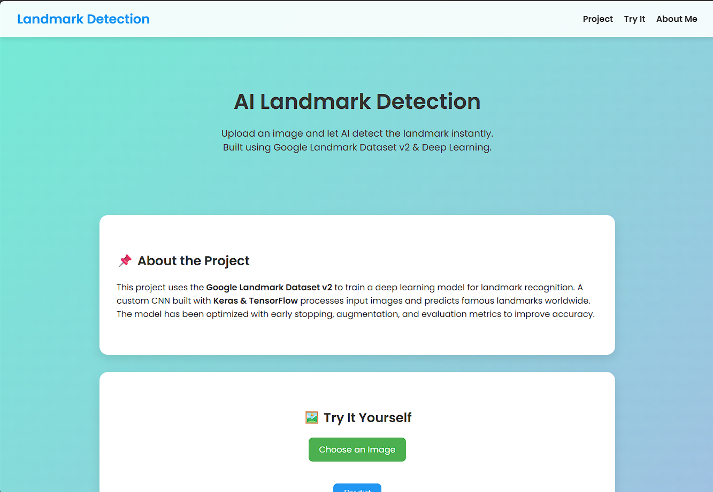
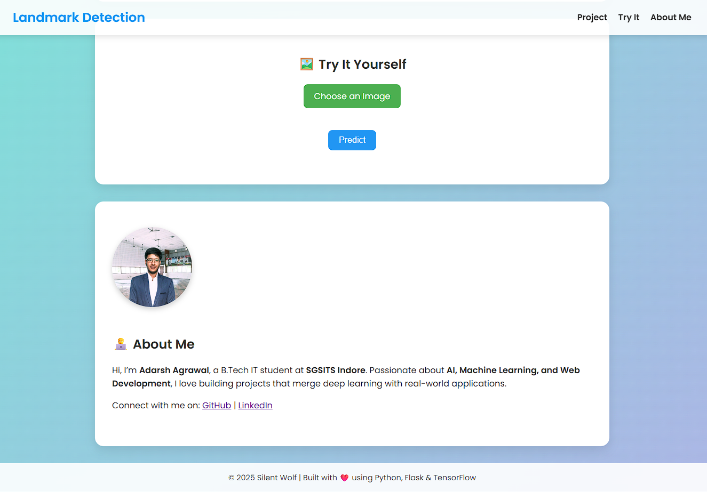
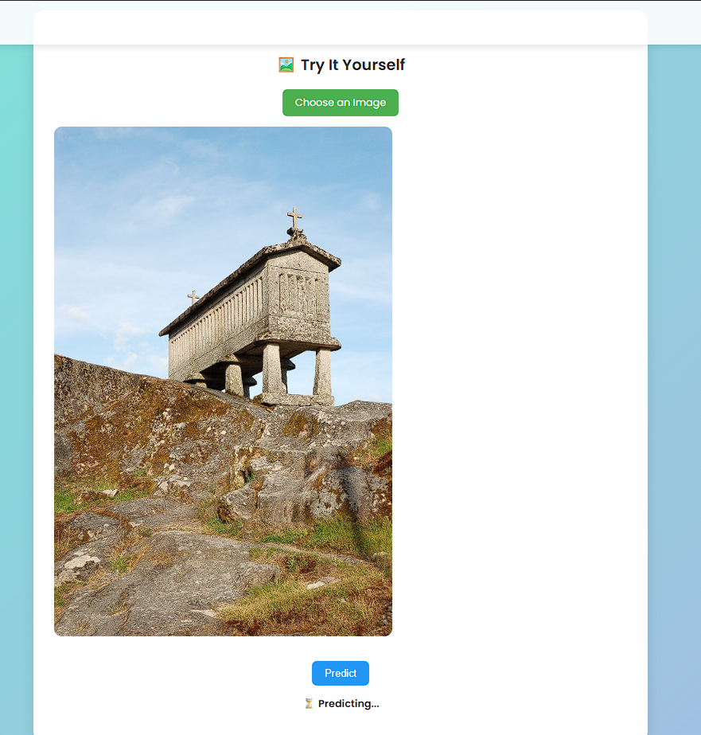

# 🏰 Google Landmark Detection v2 – Implementation

This is a **self-learning project** using the **Google Landmark Detection Dataset v2** to build a landmark prediction model.  
It combines **deep learning** with a **Flask web app** that allows users to upload images and get predictions of famous landmarks.

**🌍 Live Application:** [Landmark Detection App](https://landmark-app.onrender.com)

---

## 📖 Overview
The application leverages a **Convolutional Neural Network (CNN)** trained on Google’s landmark dataset to classify and predict landmarks from images.  
Users can interact with the model through a clean and simple **web interface**.

---

## ✨ Features
- 📸 Upload an image for landmark recognition  
- ⚡ Real-time predictions using a trained deep learning model  
- 🖥️ User-friendly web interface  
- 🚀 Deployed online for easy access  

---

## 🛠️ Technologies Used
- **Backend:** Python, Flask  
- **Deep Learning:** TensorFlow, Keras  
- **Frontend:** HTML, CSS  
- **Deployment:** Render  

---

## ⚙️ How It Works
1. **Image Upload:** User selects an image from their device.  
2. **Prediction:** The CNN model processes the image and predicts the landmark.  
3. **Result Display:** The predicted landmark name is shown in the web app.  

---

## 📂 Project Structure
Google_landmark_dataset_v2_project/
│
├── - app/ # Flask application
│ ├── - static/ # Static files (CSS, JS, images)
│ │ └── - images/
│ │ └── - profilepic.jpeg
│ └── - templates/ # HTML templates
│ └── - index.html
│ └── - main.py # Flask app entry point
│
├── - model_loader.py # Loads the trained CNN model
├── - final_model.keras # Saved trained model
├── - requirements.txt # Python dependencies
├── - Procfile # Deployment config for Render

---

## 🖼️ Screenshots & Example Predictions

**🏠 Home Page / About the Project**  


**📤 Try It Yourself / Image Upload**  


**✅ Prediction Example**  


---

---

## 🚀 Installation & Usage

1. **Clone the repository**
   ```bash
   git clone https://github.com/AgrawalAdarsh/Google_landmark_dataset_v2_project.git
   cd Google_landmark_dataset_v2_project

---   

---

## 📊 Dataset

This project uses the Google Landmark Detection Dataset v2, one of the largest publicly available landmark recognition datasets.

---

---

## 🔮 Future Work

1. Improve accuracy using transfer learning (EfficientNet, ResNet).
2. Add Top-5 predictions with confidence scores.
and many more...

---

---

## 👨‍💻 Contributor & Developer **Adarsh Agrawal**

[](https://www.linkedin.com/in/adarsh-agrawal-3b0a76268/)

---
